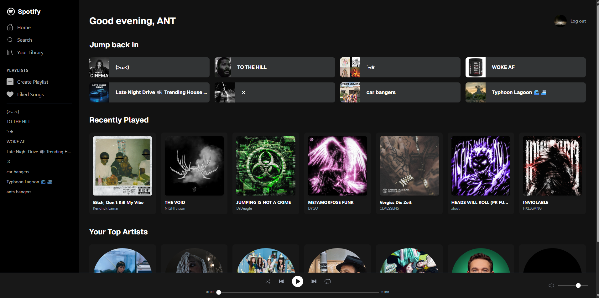
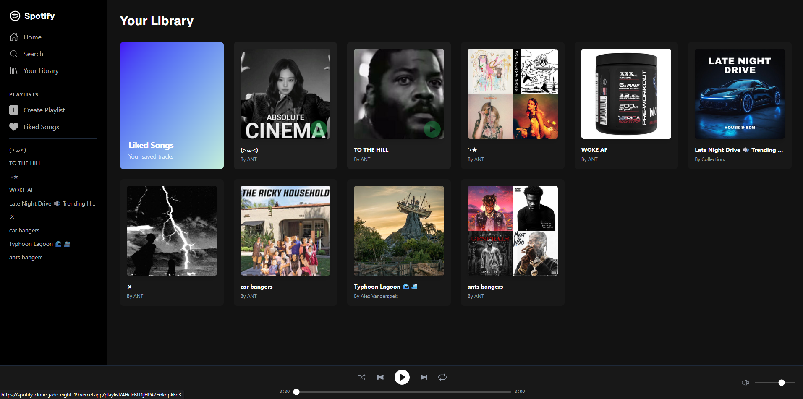
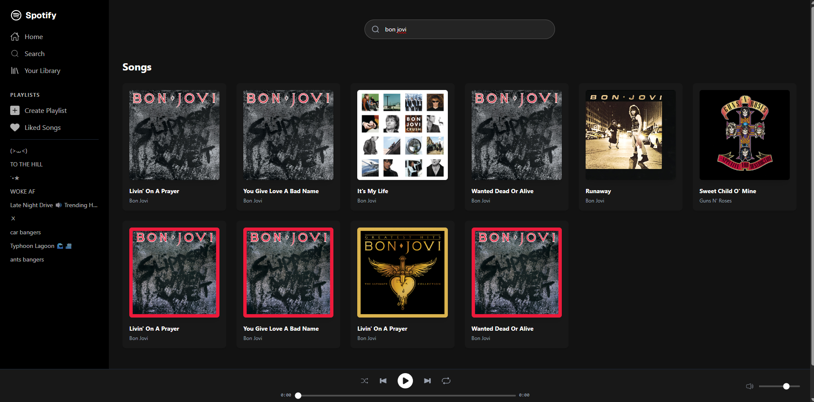

# 🎵 Spotify Clone

A React application that replicates the core Spotify experience using the Spotify Web API. Log in with your real Spotify account — the app fetches your actual playlists, recently played tracks, and top artists, and lets you browse and play 30-second audio previews.

> ⚠️ This app is in Spotify development mode. To request access to the live demo, contact me directly. A full walkthrough is available in the demo video below.

🔗 [Live Demo](https://spotify-clone-jade-eight-19.vercel.app/)
🎥 [Demo Video](https://youtu.be/hNLx1EsOHxY?si=C04_hK1AA0QEhS5y)

## 📸 Screenshots





## 🚀 Features

- Spotify OAuth 2.0 login with PKCE — no backend or exposed secrets required
- Personalized dashboard with greeting, recently played, and top artists
- Browse and play from your real Spotify playlists
- Liked Songs page pulling your actual saved tracks
- Search with debounced input hitting the Spotify API live
- Fully functional playbar — audio previews, progress bar, volume control, play/pause
- Create new playlists directly from the sidebar
- Full session management with logout

## 🛠 Tech Stack

- React + Vite (JavaScript)
- Tailwind CSS
- React Router
- Spotify Web API
- PKCE OAuth 2.0

## 🔧 How It Works

1. User clicks Log In — a PKCE code verifier and challenge are generated client-side
2. User is redirected to Spotify's auth page and grants permissions
3. Spotify redirects back with an auth code — the app exchanges it for an access token
4. Token is stored in localStorage and used to authenticate all Spotify API requests
5. Dashboard, playlists, search, and playback all pull live data from the Spotify API

## ⚠️ Known Limitations

- Audio playback uses 30-second preview URLs — full playback requires Spotify Premium and the Web Playback SDK
- Access tokens expire after 1 hour — user must log in again
- App is in Spotify development mode — external users must be whitelisted to log in

## ⚙️ Setup

1. Clone the repo
2. Run `npm install --legacy-peer-deps`
3. Create a `.env` file in the root and add:
```
VITE_SPOTIFY_CLIENT_ID=your_client_id
VITE_REDIRECT_URI=http://localhost:5173/callback
```
4. Run `npm run dev`

> Note: Use Chrome or Firefox for local dev, or log in on the live Vercel URL and copy the access token into localStorage manually.

## 👤 Author

Anthony C — [GitHub](https://github.com/anthonys-hub)